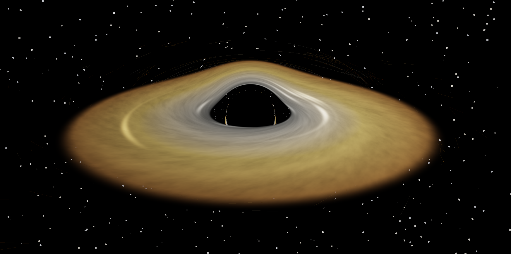

# Relativistic Black Hole Simulation Engine

A C++17 gravitational simulation that combines:
- GPU black-hole lensing & accretion-disk rendering via OpenGL compute shader
- N-body particle dynamics w/ CPU integrator or optional CUDA backend
- Interactive camera controls for free-fly & orbit viewing

## Showcase
<p align="center">
  
</p>

## Features
- Black-hole scene w/ accretion disk & lensing-style visual distortion.
- Hybrid pipeline: compute-shader background + rasterized particles/trails.
- Optional CUDA physics backend (`SIM_ENABLE_CUDA`) w/ persistent device buffers.
- Fixed-timestep simulation loop w/ frame-time accumulator.
- Orbit camera mode anchored to the singularity.
- Runtime FPS counter in window title.
- Gravity grid overlay toggle for black-hole mode.
- Runtime VSync toggle.
- CSV state export toggle at runtime.

## Controls
- `P`: Toggle orbit camera mode (anchor to singularity).
- `Space`: Pause/Resume simulation.
- `R`: Reset camera.
- `W/A/S/D`, `Q/E`: Free-fly movement (free camera mode).
- `W/S` or `Up/Down`: Zoom in/out (orbit mode).
- `Right Mouse Drag`: Rotate view.
- `G`: Toggle black-hole grid overlay.
- `V`: Toggle VSync.
- `M`: Toggle CSV export (`export.csv`).
- `Esc`: Exit.

## Quick Start (Windows)
Recommended single command:

```powershell
.\run-engine.bat
```

This runs `bootstrap.ps1` in CUDA Release mode by default, and will configure/build/launch.

Useful overrides:

```powershell
.\run-engine.bat -Mode cpu -Config Release
.\bootstrap.ps1 -Mode cuda -Config Release
.\bootstrap.ps1 -RunAfterBuild:$false
.\bootstrap.ps1 -Clean:$true
```

If PowerShell blocks script execution in your session:

```powershell
Set-ExecutionPolicy -Scope Process -ExecutionPolicy Bypass
```

## Manual Build
### CUDA path (VS2022 toolchain + NMake)
```bat
cmake -S . -B C:\Temp\cppsim_cuda_nmake22 -G "NMake Makefiles" -DCMAKE_BUILD_TYPE=Debug -DCMAKE_CUDA_COMPILER="C:/Program Files/NVIDIA GPU Computing Toolkit/CUDA/v12.4/bin/nvcc.exe"
cmake --build C:\Temp\cppsim_cuda_nmake22
C:\Temp\cppsim_cuda_nmake22\SimulationEngine.exe
```

### CPU-only path (Visual Studio generator)
```powershell
cmake -S . -B build_cpu -G "Visual Studio 17 2022" -A x64
cmake --build build_cpu --config Debug --target SimulationEngine
.\build_cpu\Debug\SimulationEngine.exe
```

## Dependencies
- CMake 3.14+
- C++17 compiler (MSVC/Clang/GCC)
- OpenGL 4.3 capable GPU/driver
- GLFW 3.4 (fetched via CMake `FetchContent`)
- GLM (fetched via CMake `FetchContent`)
- GLAD (vendored in repo)
- Optional: CUDA Toolkit + `nvcc` for CUDA physics backend

## Project Structure
- `src/Simulation.cpp`: Main loop, input, camera, timing.
- `src/Renderer.cpp`: OpenGL rendering pipeline & compute dispatch.
- `src/BlackHoleScene.cpp`: Scene setup, absorption, scene-side logic.
- `src/Integrator.cpp`: CPU n-body integrator.
- `src/CudaIntegrator.cpp` + `src/CudaIntegrator.cu`: CUDA physics backend.
- `shaders/geodesic.comp`: Black-hole lensing/accretion disk compute shader.

## Notes
- The visual lensing shader is currently an approximation model, not a full GR geodesic solver.
- CUDA physics is optional & auto-enabled only when CUDA toolchain detection succeeds at configure time.

## Credits
Initial OpenGL boilerplate & early inspiration from [kavan010/black_hole](https://github.com/kavan010/black_hole).
